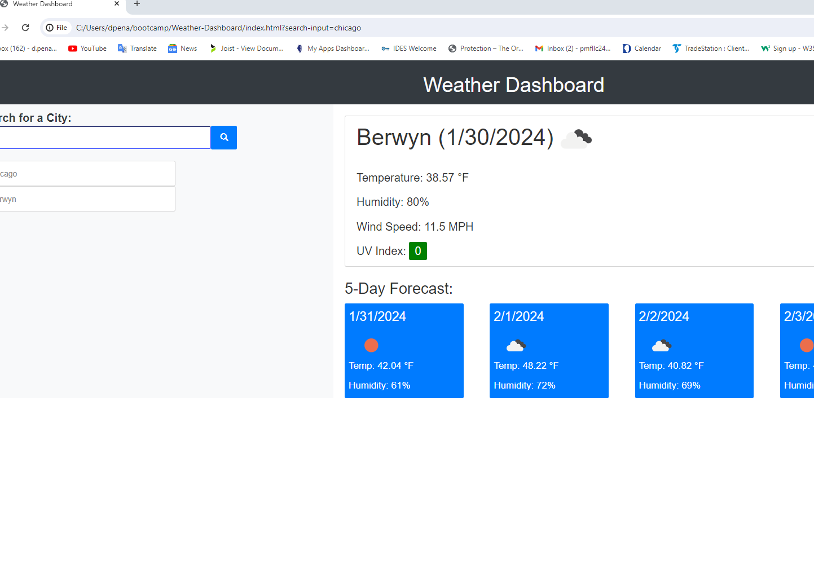

# Weather-Dashboard
Fully Functional Weather Dashboard

An application that utilizes the third-party API named OpenWeather to retrieve weather data for cities and displays weather; including(temperature, humidity, wind speed, and uv index) of the current day and the weather (temperature and humidity) for  5 following days.

Repository link: https://github.com/dpena1489/Weather-Dashboard

Active site link:

Screenshot of deployed site: 

